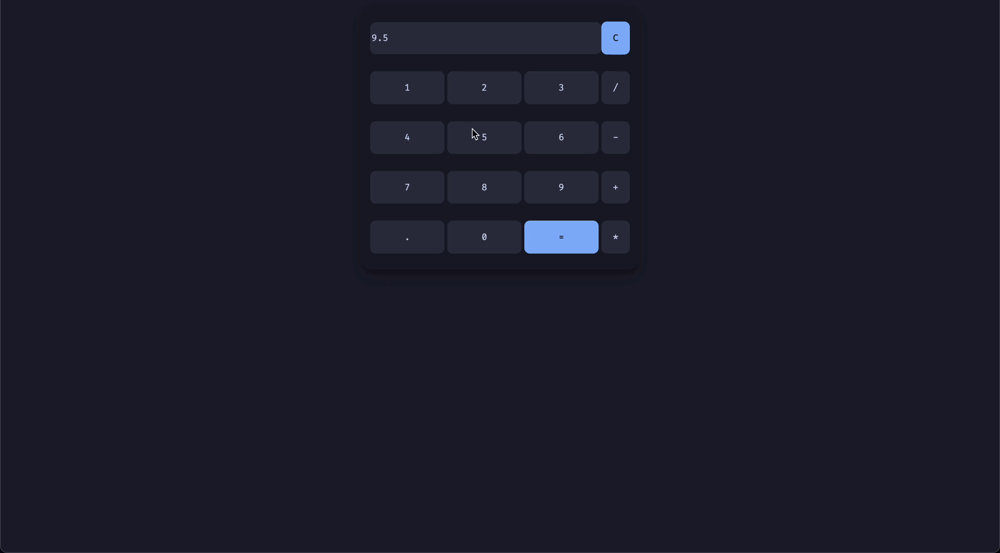

# JavaScript Calculator

I decided to make this project in order to further my understanding on how all three elements (HTML, CSS, and JavaScript) of a webpage interact with one another and come together.

I decided to make use of the _math.js_ library, which allows for evaluation of expressions inside of a string without having to use _eval_. I utilized math.js to do so because using _eval_ is considered unsafe code.
